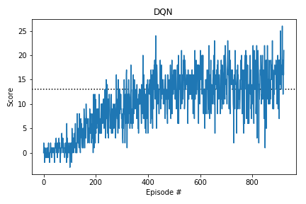
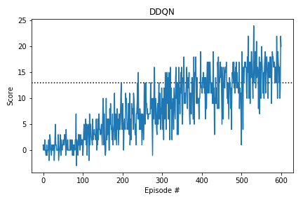

# Report

## Introduction

The agent lives in a square world and aims to collect as many yellow bananas, avoiding all blue bananas. The reward of collecting a yellow banana is `+1` while the reward for collecting a blue banana is `-1`. The task is episodic. The action space contains 4 discrete actions

- 0: forward
- 1: backward
- 2: left
- 3: right

The state space has a dimension of 37 and all dimensions are continuous. The dimensions relate to the velocity of the agent and a ray based perception of the environment.

The problem is considered solved if the agent achieves a average total score of at least `+13` in 100 subsequent episodes.

## Learning algorithm

### Deep reinforcement learning: Deep Q Network

In order to train the agent a deep Q Network (DQN) is implemented using
- using experience replay to avoid harmful correlations arising from subsequent (S, A, R, S') tuples
- using fixed target to avoid harmful correlations arising from "updating a guess with a guess". This introduced a new 'target network' (\\( w^- \\) ) of which weights are updated only occasionaly. Weight updates of the local network are defined by

\\[ \Delta w = \left( R + \gamma \mathrm{max}_a \, q \left( S', a, w^- \right) - q \left( S, A, w \right) \right) \nabla_w q \left( S, A, w \right) \\]

Deep Q-Learning tends to overestimate action values. Double Q-Learning (DDQN) has been shown to work well in practice to help with this. The implementation of DDQN follows [this paper](https://arxiv.org/abs/1509.06461) . The weights of the local NN are now updated as follows:

\\[ \Delta w = \left( R + \gamma q \left( S', \mathrm{argmax}_a \, q \left( S', a, w \right) , w^- \right)  - q \left( S, A, w \right) \right) \nabla_w q \left( S, A, w \right) \\]

### Neural Network architecture

The chosen neural network architecture is a simple fully connected network with relu activation. The network consists of three layers. The first two layers have 64 nodes, the last layer has 4 nodes corresponding to the number of actions the agent can take.

### Hyperparameters

The hyperparameters are chosen as follows:

- BUFFER_SIZE = int(1e5)  # replay buffer size
- BATCH_SIZE = 64         # minibatch size
- GAMMA = 0.99            # discount factor
- TAU = 1e-3              # for soft update of target parameters
- LR = 5e-4               # learning rate 
- UPDATE_EVERY = 4        # how often to update the network
- eps_start = 1.0         # epsilon greedy action selection - start value
- eps_end = 0.01          # epsilon greedy action selection - end value
- eps_decay = 0.995       # epsilon greedy action selection - decay rate

These values are based on experience with previous DQN problems. No tuning has been done as the initial set of parameters seemed to work rather well.

## Results

The DQN agent reached an average reward (over 100 episodes) in 922 episodes.

The DDQN agent reached an average reward (over 100 episodes) in 601 episodes.

## Future improvements

Interesting improvements to the current implementation are

- prioritized experience reply ( [paper](https://arxiv.org/abs/1511.05952) ): instead of sampling random (S, A, R, S') tuples from the replay buffer, samples from which the agent can learn a lot, ie high TD-error, are sampled with a higher probability 

- Dueling DQN ( [paper](https://arxiv.org/abs/1511.06581) ): an extention of the Neural Network to an architecture with two supporting networks where the one network learns the statevalues and the other network the so-called advantage values. The networks are then combined to learn the state-action values.