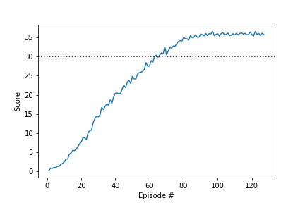

# Report

## Introduction

The *Reacher* agent is a double-jointed arm which can move to target locations. A reward of +0.1 is provided for each step that the agent's hand is in the goal location. Thus, the goal of the agent is to maintain its position at the target location for as many time steps as possible.

The observation space consists of 33 variables corresponding to position, rotation, velocity, and angular velocities of the arm. Each action is a vector with four numbers, corresponding to torque applicable to two joints. Every entry in the action vector should be a number between -1 and 1.

A 20-dimensional *Reacher* environment is used, consisting of 20 agents with double-jointed arms. These 20 agents share one *memory*, which enhences training.

The agent is considered sufficiently *trained* when the achieved average score over 100 subsequent episodes is at least 30, averaged over all 20 agents.

## Learning algorithm

### Deep reinforcement learning: Deep Deterministic Policy Gradient

In order to train the agent a Deep Deterministic Policy Gradient (DDPG) algorithm is implemented, as this algorithm allows for a continuous action space. The DDPG uses and Actor and a Critic.

- The Actor predicts the best action *deterministically*: \[ \mu (s; \theta_\mu ) = argmax_a Q(s, a)\], with \[ \theta_\mu \] the weights of the Actor Neural Network. OUNoise is added to the actions to allow for some randomness during training.
- The Critic learns to evaluate the optimal value function using the Actor's best believed action: Q ( s, \mu (s; \theta_\mu ); \theta_Q ) \] , with \[ \theta_Q \] the weights of the Critic Neural Network.

DDPG uses a replay buffer to avoid harmful correlation arriing from subsequent (S, A, R, S') tuples.

Both the Actor and the Critic make use of two Neural Network each, to avoid harmful correlations arising from updating a guess with a guess.

- The *local* networks are being optimized by interaction with the environment
- The *target* networks are slowly being updated using a *soft update* where the *local* network is mixed with the *target* network with mixing parameter *tau*. 

### Neural Network architecture

The chosen neural network architecture, for both the actor and the critic, is a fully connected network with two hidden layers and ReLu activation. Literature shows that simple network with not too many nodes in the hidden layers work best. For the actor network a `tanh` activation is applied to the last layer, to ensure output values between -1 and 1. No activation function is applied to the last layer of the Critic. 

Actor layer sizes

- input (state size): 33
- hidden layer 1: 256
- hidden layer 2: 128
- output (action size): 4

Critic layer sizes

- input (state size): 33
- hidden layer 1: 256
- hidden layer 2: 128
- output: 1

### Hyperparameters

Different sets of hyperparameters have been evaluated. Gradient clipping is applied to the Critic network. The set of hyperparameters resulting in the highest score is as follows:

- BUFFER_SIZE = int(1e6)  # replay buffer size
- BATCH_SIZE = 128        # minibatch size
- GAMMA = 0.99            # discount factor
- TAU = 1e-3              # for soft update of target parameters
- LR_ACTOR = 1e-4         # learning rate of the actor 
- LR_CRITIC = 1e-4        # learning rate of the critic
- WEIGHT_DECAY = 0        # L2 weight decay
- LEARN_EVERY = 1         # learn every x timesteps
- NUM_LEARN = 1           # perform x learning cycles before going to the next timestep

Training with these parameters seems rather stable.

The set of hyperparameters resulting in the least number of required episodes (119) to achieve the goal is, although difference with other sets of hyperparameters are marginal. Training where LEARN_EVERY is larger than 1 get still be *faster*, even though a larger number of episodes is required.

- BUFFER_SIZE = int(1e5)  # replay buffer size
- BATCH_SIZE = 128        # minibatch size
- GAMMA = 0.99            # discount factor
- TAU = 1e-3              # for soft update of target parameters
- LR_ACTOR = 1e-4         # learning rate of the actor 
- LR_CRITIC = 1e-4        # learning rate of the critic
- WEIGHT_DECAY = 0        # L2 weight decay
- LEARN_EVERY = 1         # learn every x timesteps
- NUM_LEARN = 1           # perform x learning cycles before going to the next timestep

For a full overview of all experiments the reader is referred to the notebook.

## Results

The DDPG agent reached an average score of at least 30 (over 100 episodes and averaged over 20 agents) in 126 episodes.

### Future improvements

- Experiment with other algorithms, such as the basic Actor-Critic algorithm
- Experiment with a prioritized replay buffer

