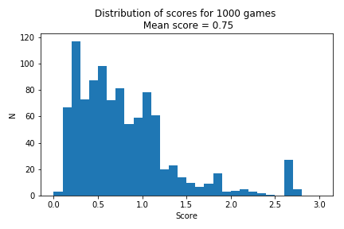

# Tennis app

## Environment

The *Tennis* environment consists of two tennis rackets. The aim is to move the tennis rackets
such that a ball is bounched back and forth over the net, without dropping the ball or
hitting the ball outside of the boundaries of the playing field. Each racket is controlled
by an agent.

The observation space consists of 8 variables corresponding to the position and velocity of 
the ball and racket. Each agent receives its own, local observation. Three subsequent 
local observations are stacked, in order to preserve temporal information on ball and racket 
movement direction. Each agent therefore has an observation space consisting of 24 continuous
elements. The *Tennis* environment provides a new local state for both agents simultaneously, given the
actions of both of the agents. The action space consists of two continuous variables, 
corresponding to the movement towards (and away) from the net and jumping. 

The *Tennis* environment provides the state, reward and done of both agents. Note that as
there are now two agents, there are also two rewards. For training the agent, the reward
corresponding the individual agent is used. However, to determine the total score achieved
in an episode the maximum score of the two agents is used. The reward structure of the
environment is as follows:

- When the agent hits the ball over the net the agent receives +0.1
- When the agent lets the ball hit the ground, or when the agent hits the ball out of the 
  boundaries of the game, it receives -0.01 

The agents are considered sufficiently trained, when the achieved average score over 100 
subsequent episodes is at least 0.5.

## Learning algorithm

Two learning algorithms are included in this repository. The MADDPG algorithm is suitable
for environments where mulitple agents interact. The DDPG is at the base of the MADDPG algorithm
and is designed to work with one agent. Both DDPG and MADDPG work well with a continuous 
action space and are therefor suitable for the *Tennis* environment.

### Deep Deterministic Policy Gradient

The DDPG algorithm is an Actor-Critic method that utilises two Neural Networks.

- The Actor Network predicts the best action *deterministically*:  
   
  with 
   
  the weights of the Actor Neural Network. OUNoise is added to the actions to allow for some randomness during training.
- The Critic Network learns to evaluate the optimal value function using the Actor's best believed action: 
  
  with 
  
  the weights of the Critic Neural Network.

Althought the DDPG algorithm is usually used to train 1 agent, it can be used to solve the Tennis environment. 
The action and state space are symmetric between the agents, with movements defined as towards/away from the net
rather then left/right. Moreover, both agents have an identical reward structure. It is therefore possible to
train 1 agent, which can be used to generate actions for both agents.

### Multi Agent Deep Deterministic Policy Gradient 

The Multi Agent Deep Deterministic Policy Gradient (MADDPG) algorithm
is an extension of the standard DDPG, and allows to train a system with 
multiple agents which interact either in a collaborative (which is the case of this project)
or competitive fashion. Each agent is essentially a DDPG-agent, which uses both an
Actor and a Critic. The difference with the standard DDPG, is that the Critic receives 
information from both the own agent as the other agent(s) and therefore has *more* information
to learn from than only it's own information. The Actor receives information 
only from the own agent, which allows for usage of the trained agent in a fashion independent
of the other agent. 

- The Actor predicts the best action *deterministically* based on the state observed by the agent: 
  
  with 
  
  the weights of the Actor Neural Network, and *1* referring to the agent's *own* information. OUNoise is added to the actions to allow for some randomness during training.
- The Critic learns to evaluate the optimal value function using the Actor's best believed action and the *other agent's action*, plus the observations of both the agent and the *other agent*: 
  
  with 
  
  the weights of the Critic Neural Network, and *1* (*2*) referring to the *own* (*other*) agent.

### Replay Buffer

Both DDPG and MADDPG use a replay buffer to avoid harmful correlation arrising from 
subsequent (S, A, R, S') tuples, so called experiences.
A simple implementation of the replay buffer is provided, where experience tuples leave the buffer in order of entrance.
Alternatively, a prioritized replay buffer can be used, where more attention is given to those experiences
whose contributions to the weight updates are deemed most valuable. 

For the MADDPG agent, the replay buffer is shared between the two agents in the MADDPG: each S in the 
experience tuple contains the states of both agents and each A contains the actions of both agents.

## Neural Networks

### Local and target Networks

Both the Actor and the Critic make use of two Neural Network each, to avoid harmful correlations arising from updating a guess with a guess.
This is the case for DDPG as wel as for MADDPG.

- The *local* networks are being optimized by interaction with the environment. The *local* network is 
  also the network which, once the agent is trained, is used to choose actions.
- The *target* networks are slowly being updated using a *soft update* where the *local* network is 
  mixed with the *target* network with mixing parameter *tau*. The *target* can be interpreted as *label*. 
  The usage of predicted actions (Actor) and Q-values (Critic) by the *target* network is similar to 
  those of labels in a supervised learning setting.

Note that as our MADDPG agent contains two agents, the MADDPG object contains a total of 2x4=8 Neural Networks,
whereas the DDPG object contains 4 Neural Networks.

.

### Neural Network architecture

The chosen neural network architecture, for both the actor and the critic, is a fully connected network with two hidden layers and ReLu activation. Literature shows that simple network with not too many nodes in the hidden layers works best. For the actor network a `tanh` activation is applied to the last layer, to ensure output values between -1 and 1. No activation function is applied to the last layer of the Critic. Batch Normalisation is (optionally) applied after the first fully connected layer of both the Actor and the Critic. 

There is a slight difference between the Critic architecture of the DDPG compared to the MADDPG. The DDPG uses the state 
as input for the first fully connected layer. The output of the first layer is concatenated with
the action and serves as input of the second fully connected layer. In the MADDPG the concatenated states 
and actions of both agents form the input to the first fully connected layer.

### Layer sizes 

Actor layer sizes

- input (state size): 24
- hidden layer 1: 256
- hidden layer 2: 128
- output (action size): 2

Critic layer sizes DDPG

- input: 24 (state size) and 2 (action size)
- hidden layer 1: 256
- hidden layer 2: 128
- output: 1

Critic layer sizes MADDPG

- input (2 * state size + 2 * action size): 52
- hidden layer 1: 256
- hidden layer 2: 128
- output: 1

### Hyperparameters

Different sets of hyperparameters have been evaluated. Gradient clipping is (optionally) applied to the Critic network. 
The following hyperparameters are set in de file `hyperparameters.py`. The DDPG and the MADDPG both have
their own hyperparameters saved in the respective folders.

A second set of hyperparameters relating to the training loop are set in the notebooks `Tennis.ipynb` and `Tennis_DDPG.ipynb`.

#### Hyperparameters MADDPG

Hyperparameters in `MADDPG/hyperparameters.py`:

    BUFFER_SIZE = int(1e4)         # Replay buffer size
    BATCH_SIZE = 256               # Minibatch size
    GAMMA = 0.95                   # Discount factor
    TAU = 0.02                     # Soft update of target parameters
    ACTOR_FC1_UNITS = 256          # Number of hidden units in layer 1 in the actor model
    ACTOR_FC2_UNITS = 128          # Number of hidden units in layer 2 of the actor model
    CRITIC_FC1_UNITS = 256         # Number of hidden units in layer 1 of the critic model
    CRITIC_FC2_UNITS = 128         # Number of hidden units in layer 2 of the critic model
    ACTOR_LR = 1e-3                # learning rate of the actor 
    CRITIC_LR = 1e-3               # learning rate of the critic
    WEIGHT_DECAY = 0               # L2 weight decay
    DO_GRADIENT_CLIP_CRITIC = True # Gradient clipping of critic parameters
    DO_APPLY_BATCH_NORM = True     # Add batch normalisation after first hidden layer of both Actor and Critic NN
    LEARN_EVERY = 1                # Learn every N timesteps
    N_LEARN = 1                    # When learning, learn N times (must be >= 1)

Parameters in `Tennis.ipynb`:

    random_seed = 42               # random seed for initialization numpy and torch
    n_episodes = 6000              # maximum number of episodes to play in training
    t_max = 1000                   # maximum number of steps in each episode
    add_noise=True                 # whether to add noise to the actions while training
    noise_decay = 0.999            # factor by which noise is decreased at each episode
    n_random_episodes = 300        # number of episodes to play with random actions
    n_extra_episodes = 600         # number of episodes to play after environment has been solved
    version = 'v18'                # training version (for saving checkpoints and plots)

#### Hyperparameters DDPG

Hyperparameters in `DDPG/hyperparameters.py`:

    BUFFER_SIZE = int(1e4)          # replay buffer size
    BATCH_SIZE = 256                # minibatch size
    GAMMA = 0.95                    # discount factor
    TAU = 0.02                      # for soft update of target parameters
    LR_ACTOR = 1e-3                 # learning rate of the actor 
    LR_CRITIC = 1e-3                # learning rate of the critic
    WEIGHT_DECAY = 0                # L2 weight decay
    NOISE_DECAY = 0.999             # decrease the size of the noise
    LEARN_EVERY = 20                # learn every N timesteps
    N_LEARN = 10                    # learn N times 
    DO_GRADIENT_CLIP_CRITIC = False # Gradient clipping of critic parameters

Parameters in `Tennis_DDPG.py`:

    random_seed = 42
    n_episodes = 3000
    n_random_episodes = 300
    t_max = 1000
    add_noise=True
    noise_decay = 0.999
    version = 'v3'

#### Some observations when training the MADDPG agent

The changing of the following hyperparameters did have some impact on the training, but 
did not result in a solved environment

- Learning rate around 1e-3 gives slightly better results than smaller (no learning) or bigger (fast critical forgetting) learning rate
- Changing the discount factor from 0.95 to 0.99 did not have a big impact on training
- Changing the soft update parameter tau from 0.02 tot 0.001 did not have a big impact on training
- Gradient clipping did not have a big impact on training
- Application of batch normalisation did not have a big impact on training 

In all of the above scenarios the agent trained to a score of approximately 0.4 before the
score started dropping again.

#### Changes to (hyperparameter) settings that did have a big impact when training the MADDPG agent

- Increase the buffer size to 1e4
- Use an actions from a normal distribution for the 300 first episodes. The actions taken
  by an untrained agent leads to a much lower success rate than random actions taken from
  a normal distribution. By using actions from a normal distribution for the first 300 episodes
  we guarantee there are sufficient examples of good actions for the agent to learn from.
- Randomly adjust the sign of the noise added to the action. Even though OUNoise is designed
  to work without this extra feature, in practise the addition of the random sign allows for
  more exploration which in the case of the Tennis environment was necessary to start learning.
- Decrease the size of the noise added to the action during with each episode of training.
  At the start of training more exploration is done, whereas during training the agent moves
  towards more and more exploitation.

#### Observations when training the DDPG agent

Having trained the more complex MADDPG agent first, already an approximate set of good hyperparameters
was available to train the DDPG agent, achieving reasonable results, though not reaching the solved
criterium yet. In contrast to the MADDPG, gradient clipping and batch normalisation are not used in final 
set of hyperparameters for the DDPG agent.

#### Changes to (hyperparameter) settings that did have a big impact when training the DDPG agent

Experiments with learning every N steps (instead of all steps) and performing multiple learning
cycles at once (instead of only performing 1 learning cycle) proofed to be beneficial for training
and are used by the DDPG agent. Not only is the solved criterium reached in a fewer number of episodes, 
also the maximum average score over 100 episodes tends to be higher. 

It must be noted though that both for the MADDPG and the DDPG agent training seems somewhat unstable, with
the agent training fine for one run, and not at all for a second run with the same set of (hyper)parameters.

### Results

#### MADDPG

The MADDPG agent reached an average score of 0.5 over 100 subsequent episodes after 1385 episodes. 
Training was continued for another 600 episodes. The average score increased further to a
maximum of 0.763. The average score seems fairly stable above 0.5, dropping just below it only
for a few episodes between episodes 1821 and 1911, after which the score starts to increase 
again. From previous experiments is was learned that training the agent for too long after the 
limit of 0.5 is reached leads to critical forgetting, where the score drops far below 0.5 and
might eventually even decrease to zero. The checkpoints of agent at episode 1649, where it
reaches it highest score of 0.763 are saved and included in this repository.

To check the performance of the trained MADDPG agent, it is used to play 1000 games of Tennis. The histogram
of scores follows an exponential distribution. An interpretation of this is that it is easier to play a short game
of tennis than to keep the ball in the game for a long time, which by intuition seems similar to the performance
of human players.

#### DDPG

The DDPG agent reached an average score of 0.5 over 100 subsequent episodes after 909 episodes. 
Training was continued for another 600 episodes. The average score seems fairly stable above 0.5 for 
another 500 episodes, after which is suddenly drops dramatically. The maximum average score reached 
before critical forgetting is 0.932. The checkpoints of the agent at episode 1339, where it
reaches it highest score are saved and included in this repository.

To check the performance of the trained DDPG agent, it is used to play 1000 games of Tennis. 
Interestingly, the histogram of scores follows a bimodal distribution with peaks around the scores
of 0.1 and 2.6. An interpretation of this is that there are certain starting situations of the game 
at which the agent performs very well, while there are other starting situation where agent seems to
fail almost immediately. A visual inspection of the successfull and failing games could provide 
some insides in the cases where the agent shows poor performance. Unfortunately, I have not carried
out such inspection as the Udacity Workspace does not allow for visual inspection, neither have
I managed to get the environment working on my laptop due to security reasons.

### Further improvements

Both the DDPG and the MADDPG agent could profit from a priorized experience replay, where most valuable
experiences are favoured over those that are less valuable.

As an alternative to (MA)DDPG it would be interesting to investigate alternative learning algorithms
such as [Trust Region Policy Optimization](https://arxiv.org/abs/1502.05477) 
or [Twin Delayed DDPG](https://arxiv.org/abs/1802.09477). Both algorithms can be used with continuous
actions spaces, and promise to be less brittle  with respect to hyperparameters and other kinds of tuning. 

